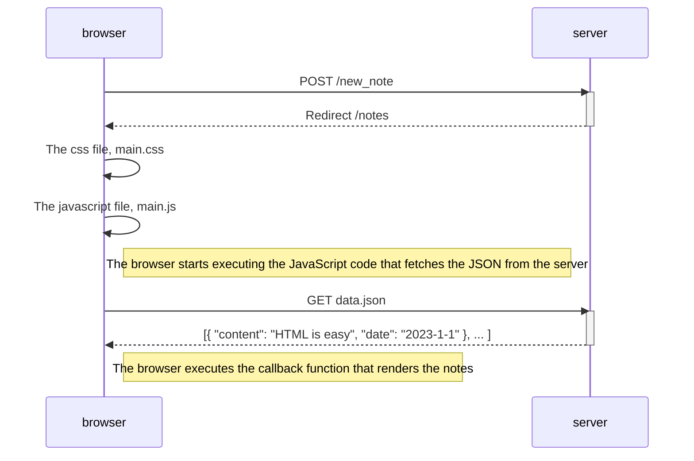

```mermaid

sequenceDiagram
    participant browser
    participant server

    browser->>server: POST /new_note
    activate server
   server-->>browser: Redirect /notes
   deactivate server

    browser->>browser: The css file, main.css


    browser->>browser: The javascript file, main.js


    Note right of browser: The browser starts executing the JavaScript code that fetches the JSON from the server

    browser->>server: GET data.json
    activate server
    server-->>browser: [{ "content": "HTML is easy", "date": "2023-1-1" }, ... ]
    deactivate server

    Note right of browser: The browser executes the callback function that renders the notes
```
